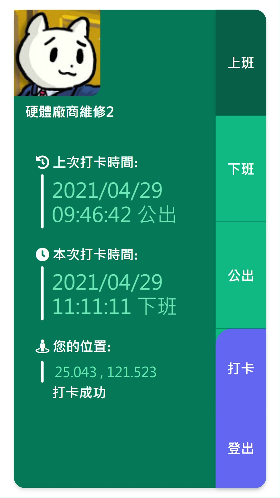
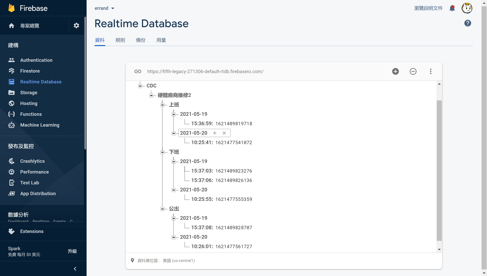

# cdc-errand ver. 0.1.2
# 疾管點點名 ver. 0.1.2

DEMO網頁: https://zhaohoulin.github.io/cdc-errand/?openExternalBrowser=1

## 功能 & 特色
* 以google帳號登入
* 抓取在公司附近的定位才能打卡(目前停用)

## 修改內容
* 資料搬到 Realtime Database
* 日期資料結構更改
